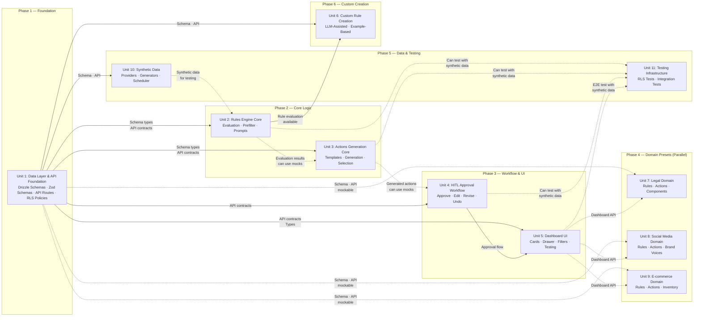

# Implementation Plan: Adeo

## Implementation Units Overview

This plan decomposes the Phase 6 technical specification into parallelizable implementation units optimized for concurrent development across isolated worktrees. The decomposition minimizes cross-worktree file conflicts while respecting the sequential dependencies between tightly-coupled layers.

| Unit | Name | Description | FR Coverage | Complexity | Dependencies |
|------|------|-------------|--------------|------------|--------------|
| 1 | Data Layer & API Foundation | Database schemas, migrations, Zod validation, REST API routes | FR-1.0, FR-2.0, FR-3.0, FR-6.0 | High | None (Foundation) |
| 2 | Rules Engine Core | Evaluation logic, prefilter pipeline, prompt handling | FR-1.1-1.12 | High | Unit 1 |
| 3 | Actions Generation Core | Action templates, generation, selection, revision | FR-2.1-2.8 | Medium | Unit 1, Unit 2 |
| 4 | HITL Approval Workflow | Approval decisions, revision, undo window | FR-3.1-3.6 | Medium | Unit 1, Unit 3 |
| 5 | Dashboard UI | Dashboard components, action cards, drawer, filters | FR-4.1-4.13 | Medium | Unit 1, Unit 4 |
| 6 | Custom Rule Creation | LLM-assisted and example-based rule creation UI | FR-5.1-5.5 | Medium | Unit 1, Unit 2 |
| 7 | Domain Preset: Legal | Legal domain components and seed data | FR-7.1-7.9 | High | Unit 1, Unit 5 |
| 8 | Domain Preset: Social Media | Social media domain components and seed data | FR-8.1-8.10 | High | Unit 1, Unit 5 |
| 9 | Domain Preset: E-commerce | E-commerce domain components and seed data | FR-9.1-9.9 | High | Unit 1, Unit 5 |
| 10 | Synthetic Data Generation | Data source providers, synthetic generators, scheduler | FR-10.1-10.10 | Medium | Unit 1 |
| 11 | Testing Infrastructure | Testing utilities, RLS isolation tests, integration tests | NFRs | Medium | All units |

## Dependency Graph



### Dependency Explanation

- **Hard dependencies (solid arrows)**: Unit B cannot start ANY work without Unit A's output (types, schemas, contracts)
- **Soft dependencies (dashed arrows)**: Unit B can develop against mocks/stubs and integrate later
- **Critical path**: Unit 1 -> Unit 2 -> Unit 3 -> Unit 4 -> Unit 5 is the serial chain. After Unit 1, most units can work in parallel using mock data.

## Unit Definitions

### Unit 1: Data Layer & API Foundation

**Scope:** Complete database schema with Drizzle ORM, Zod validation schemas, REST API endpoints, and Row-Level Security policies for multi-tenant isolation.

**Owns (files/directories):**
- `frontend/src/db/schema/rules.ts`
- `frontend/src/db/schema/actions.ts`
- `frontend/src/db/schema/communications.ts`
- `frontend/src/db/schema/approval.ts`
- `frontend/src/db/schema/tenant.ts`
- `frontend/src/db/schema/entities.ts`
- `frontend/src/db/schema/data-sources.ts`
- `frontend/src/db/schema/domain-presets.ts`
- `frontend/src/db/schema/brand-voice-profiles.ts`
- `frontend/src/lib/schemas/rules.ts`
- `frontend/src/lib/schemas/evaluations.ts`
- `frontend/src/lib/schemas/actions.ts`
- `frontend/src/lib/schemas/dashboard.ts`
- `frontend/src/lib/schemas/approval.ts`
- `frontend/src/lib/db/tenant.ts`
- `frontend/src/lib/db/middleware.ts`
- `frontend/src/app/api/v1/rules/[id]/route.ts`
- `frontend/src/app/api/v1/rules/route.ts`
- `frontend/src/app/api/v1/actions/route.ts`
- `frontend/src/app/api/v1/approvals/decide/route.ts`
- `frontend/src/app/api/v1/dashboard/items/route.ts`
- `frontend/src/app/api/v1/communications/route.ts`
- `backend/src/agent/llm/client.py`
- `backend/src/config/models.py`
- Database migration files (SQL)

**FR Coverage:**
- FR-1.0 (rules data model + API)
- FR-2.0 (actions data model + API)
- FR-3.0 (approval data model + API)
- FR-6.0-FR-6.10 (multi-tenancy, RLS, tenant context)
- FR-10.0 (communications, data_sources tables)

**Dependencies:**
- None - This is the foundation unit

**Interface Contract — Exports:**
```typescript
// Zod Schemas (frontend/src/lib/schemas/)
export const RuleCreateSchema: z.ZodType<RuleCreateInput>
export const RuleResponseSchema: z.ZodType<RuleResponse>
export const ActionCreateSchema: z.ZodType<ActionCreateInput>
export const EvaluationResultSchema: z.ZodType<EvaluationResult>
export const ApprovalDecisionSchema: z.ZodType<ApprovalDecision>
export const DashboardFiltersSchema: z.ZodType<DashboardFilters>

// API Endpoints
POST   /api/v1/rules          -> 201 { data: RuleResponseSchema }
GET    /api/v1/rules          -> 200 { data: RuleResponseSchema[], meta: PaginationMeta }
GET    /api/v1/rules/:id      -> 200 { data: RuleResponseSchema } | 404
PATCH  /api/v1/rules/:id      -> 200 { data: RuleResponseSchema } | 404
DELETE /api/v1/rules/:id      -> 204 | 404
POST   /api/v1/rules/:id/toggle -> 200 { data: RuleResponseSchema }
POST   /api/v1/rules/:id/dry-run -> 200 { data: EvaluationResult[] }
POST   /api/v1/actions        -> 201 { data: ActionResponseSchema }
GET    /api/v1/actions        -> 200 { data: ActionResponseSchema[] }
POST   /api/v1/approvals/decide -> 200 { data: ApprovalResult }
POST   /api/v1/approvals/:id/undo -> 200 { data: { status: string } }
GET    /api/v1/dashboard/items  -> 200 { data: ActionItemCardSchema[] }

// Database Tenant Context
function setTenantContext(tenantId: string): Promise<void>
function resetTenantConnection(): Promise<void>
```

**Interface Contract — Imports:**
- None required from other units - this is the foundation

**Mock Strategy for Parallel Development:**
- N/A - This is the foundation that provides mocks to other units

**Requirements:**

#### FR-1.0 Rules Engine Architecture

The system **SHALL** provide a configurable rules engine that evaluates incoming communications against user-defined or preset rules to detect actionable items.

**Data Model (`rules`):**
```sql
CREATE TABLE rules (
    id UUID PRIMARY KEY DEFAULT gen_random_uuid(),
    tenant_id UUID NOT NULL DEFAULT current_setting('app.current_tenant')::UUID,
    name VARCHAR(255) NOT NULL,
    description TEXT,
    compatible_data_sources JSONB NOT NULL DEFAULT '["email"]',
    prefilter_type VARCHAR(50) NOT NULL DEFAULT 'keyword',
    prefilter_config JSONB,
    evaluation_prompt TEXT NOT NULL,
    priority INTEGER NOT NULL DEFAULT 100,
    short_circuit BOOLEAN NOT NULL DEFAULT false,
    action_selection_mode VARCHAR(50) NOT NULL DEFAULT 'present_all',
    custom_selection_prompt TEXT,
    is_enabled BOOLEAN NOT NULL DEFAULT true,
    status VARCHAR(20) NOT NULL DEFAULT 'active',
    domain_preset VARCHAR(50),
    confidence_thresholds JSONB,
    created_at TIMESTAMPTZ NOT NULL DEFAULT NOW(),
    updated_at TIMESTAMPTZ NOT NULL DEFAULT NOW()
);

CREATE INDEX idx_rules_tenant ON rules(tenant_id);
CREATE INDEX idx_rules_priority ON rules(tenant_id, priority);
CREATE INDEX idx_rules_status ON rules(tenant_id, status);
```

**Drizzle Schema:**
```typescript
// frontend/src/db/schema/rules.ts
export const rules = pgTable('rules', {
  id: uuid('id').primaryKey().defaultRandom(),
  tenantId: uuid('tenant_id').notNull().default(''),
  name: varchar('name', { length: 255 }).notNull(),
  description: text('description'),
  compatibleDataSources: jsonb('compatible_data_sources').notNull().$type<string[]>().default(['email']),
  prefilterType: varchar('prefilter_type', { length: 50 }).notNull().default('keyword'),
  prefilterConfig: jsonb('prefilter_config').$type<{
    keywords?: string[];
    patterns?: string[];
    llm_model?: string;
  }>(),
  evaluationPrompt: text('evaluation_prompt').notNull(),
  priority: integer('priority').notNull().default(100),
  shortCircuit: boolean('short_circuit').notNull().default(false),
  actionSelectionMode: varchar('action_selection_mode', { length: 50 }).notNull().default('present_all'),
  customSelectionPrompt: text('custom_selection_prompt'),
  isEnabled: boolean('is_enabled').notNull().default(true),
  status: varchar('status', { length: 20 }).notNull().default('active'),
  domainPreset: varchar('domain_preset', { length: 50 }),
  confidenceThresholds: jsonb('confidence_thresholds').$type<{
    court_deadline?: number;
    case_number?: number;
    party_name?: number;
    hearing_date?: number;
  }>(),
  createdAt: timestamp('created_at', { withTimezone: true }).notNull().defaultNow(),
  updatedAt: timestamp('updated_at', { withTimezone: true }).notNull().defaultNow(),
}, (table) => [
  index('idx_rules_tenant').on(table.tenantId),
  index('idx_rules_priority').on(table.tenantId, table.priority),
  index('idx_rules_status').on(table.tenantId, table.status),
]);
```

**Zod Validation (`frontend/src/lib/schemas/rules.ts`):**
```typescript
import { z } from 'zod';

export const PrefilterConfigSchema = z.object({
  keywords: z.array(z.string()).optional(),
  patterns: z.array(z.string()).optional(),
  llm_model: z.string().optional(),
}).optional();

export const ConfidenceThresholdsSchema = z.object({
  court_deadline: z.number().min(0).max(1).optional(),
  case_number: z.number().min(0).max(1).optional(),
  party_name: z.number().min(0).max(1).optional(),
  hearing_date: z.number().min(0).max(1).optional(),
});

export const RuleCreateSchema = z.object({
  name: z.string().min(1).max(255),
  description: z.string().optional(),
  compatibleDataSources: z.array(z.string()).default(['email']),
  prefilterType: z.enum(['keyword', 'pattern', 'llm_classification']).default('keyword'),
  prefilterConfig: PrefilterConfigSchema,
  evaluationPrompt: z.string().min(10).max(10000),
  priority: z.number().int().min(1).max(1000).default(100),
  shortCircuit: z.boolean().default(false),
  actionSelectionMode: z.enum(['present_all', 'context_aware', 'custom_prompt']).default('present_all'),
  customSelectionPrompt: z.string().optional(),
  isEnabled: z.boolean().default(true),
  status: z.enum(['draft', 'active', 'disabled']).default('active'),
  domainPreset: z.enum(['legal', 'social_media', 'ecommerce']).optional(),
  confidenceThresholds: ConfidenceThresholdsSchema.optional(),
});

export const RuleUpdateSchema = RuleCreateSchema.partial().omit({ tenantId: true });

export const RuleResponseSchema = RuleCreateSchema.extend({
  id: z.string().uuid(),
  createdAt: z.string().datetime(),
  updatedAt: z.string().datetime(),
});
```

**API Endpoints:**
- `POST /api/v1/rules` — Create rule -> 201 `{ data: RuleResponseSchema }`
- `GET /api/v1/rules` — List rules -> 200 `{ data: RuleResponseSchema[], meta: { total, page, limit } }`
- `GET /api/v1/rules/:id` — Get rule -> 200 `{ data: RuleResponseSchema }` | 404
- `PATCH /api/v1/rules/:id` — Update rule -> 200 `{ data: RuleResponseSchema }` | 404
- `DELETE /api/v1/rules/:id` — Soft delete (set status=disabled) -> 204 | 404
- `POST /api/v1/rules/:id/toggle` — Toggle enabled state -> 200 `{ data: RuleResponseSchema }` | 404
- `POST /api/v1/rules/:id/dry-run` — Dry run mode -> 200 `{ data: EvaluationResult[] }`

**Security Considerations:**
- All queries MUST filter by `tenant_id` from authenticated session
- RLS policies required on `rules` table (see FR-6.0 for full RLS spec)
- Evaluation prompts should be sanitized for prompt injection (NFR-4.5)
- Pre-filter prompts require injection resistance validation

#### FR-6.0 Multi-Tenancy and Data Isolation

The system **SHALL** ensure complete data isolation between tenants using defense-in-depth architecture.

**Data Model (`tenant_settings`):**
```sql
CREATE TABLE tenant_settings (
    id UUID PRIMARY KEY DEFAULT gen_random_uuid(),
    tenant_id UUID NOT NULL UNIQUE,
    domain_preset VARCHAR(50),
    settings JSONB NOT NULL DEFAULT '{}',
    created_at TIMESTAMPTZ NOT NULL DEFAULT NOW(),
    updated_at TIMESTAMPTZ NOT NULL DEFAULT NOW()
);

-- Enable RLS on all tables
ALTER TABLE rules ENABLE ROW LEVEL SECURITY;
ALTER TABLE actions ENABLE ROW LEVEL SECURITY;
ALTER TABLE communications ENABLE ROW LEVEL SECURITY;
ALTER TABLE generated_actions ENABLE ROW LEVEL SECURITY;
ALTER TABLE entities ENABLE ROW LEVEL SECURITY;
ALTER TABLE tenant_settings ENABLE ROW LEVEL SECURITY;

-- RLS Policies
CREATE POLICY rules_tenant_isolation ON rules
    USING (tenant_id::text = current_setting('app.current_tenant'));

CREATE POLICY actions_tenant_isolation ON actions
    USING (tenant_id::text = current_setting('app.current_tenant'));
```

**Tenant Context Setup:**
```typescript
// frontend/src/lib/db/tenant.ts
import { drizzle } from 'drizzle-orm/node-postgres';
import { sql } from 'drizzle-orm';

export async function setTenantContext(tenantId: string) {
  const db = getDb();
  await db.execute(sql`SET app.current_tenant = ${tenantId}`);
}

export async function resetTenantConnection() {
  const db = getDb();
  await db.execute(sql`RESET app.current_tenant`);
}
```

---

### Unit 2: Rules Engine Core

**Scope:** Rule evaluation logic including prefilter pipeline (keyword, pattern, LLM classification), LLM-based evaluation with structured output parsing, confidence threshold checking, and short-circuit behavior.

**Owns (files/directories):**
- `backend/src/agent/evaluator/rules_engine.py`
- `backend/src/agent/evaluator/threshold_checker.py`
- `backend/src/agent/prefilter/keyword_filter.py`
- `backend/src/agent/prefilter/llm_classifier.py`
- `backend/src/agent/prefilter/parallel_executor.py`
- `backend/src/agent/validators/output_validator.py`
- `backend/src/agent/prompts/evaluation_prompt.py`
- `backend/src/agent/prompts/templates/evaluation_v1.yaml`
- `frontend/src/components/rules/RuleTester.tsx`

**FR Coverage:**
- FR-1.1 (rule definition components)
- FR-1.2 (prefilter strategies)
- FR-1.3 (structured output schemas)
- FR-1.4 (priority evaluation + short-circuit)
- FR-1.7 (parallel prefilter execution)
- FR-1.8 (few-shot examples)
- FR-1.9 (reasoning limits)
- FR-1.10 (output validation + retry)
- FR-1.11 (confidence thresholds)
- FR-1.12 (prompt template structure)

**Dependencies:**
- Unit 1 (Data Layer) - Required for schema types and API contracts

**Interface Contract — Exports:**
```python
# Backend Python Interface
async def evaluate_rules(communication: Communication, rules: list[Rule]) -> list[EvaluationResult]:
    """Evaluate all rules against a communication, respecting priority and short-circuit."""

async def run_parallel_prefilters(communication: Communication, rules: list[Rule]) -> dict[UUID, bool]:
    """Run all prefilters in parallel, return dict of rule_id -> should_evaluate."""

async def validate_and_parse(schema: type, raw_output: str, max_retries: int = 1) -> ParsedResult:
    """Validate LLM output against schema with retry logic."""

def build_evaluation_prompt(rule: Rule, communication: Communication) -> str:
    """Build evaluation prompt with few-shot examples."""

def check_confidence_thresholds(result: EvaluationResult, thresholds: dict) -> EvaluationResult:
    """Check confidence thresholds and flag for manual review."""
```

**Interface Contract — Imports:**
```python
# From Unit 1
from frontend.db.schema import Rule, Communication, EvaluationResult
from frontend.lib.schemas import EvaluationResultSchema

# Mock strategy for parallel development:
# - Use synthetic communication data for testing
# - Mock LLM responses with predefined outputs
# - Unit can test against stubbed API responses
```

**Requirements:**

#### FR-1.2 Prefilter Strategies

The system **SHALL** support multiple pre-filter strategies: keyword/pattern matching and lightweight LLM-based classification (yes/no).

**Implementation:**
- `backend/src/agent/prefilter/keyword_filter.py` - Keyword/pattern matching
- `backend/src/agent/prefilter/llm_classifier.py` - LLM classification using Qwen2.5-0.5B model

#### FR-1.4 Priority Evaluation + Short-Circuit

The system **SHALL** evaluate rules in priority order, with configurable short-circuit behavior allowing high-priority rules to halt lower-priority evaluations.

**Implementation (`backend/src/agent/evaluator/rules_engine.py`):**
```python
async def evaluate_rules(communication: Communication, rules: list[Rule]) -> list[EvaluationResult]:
    results = []
    for rule in sorted(rules, key=lambda r: r.priority):
        result = await evaluate_single_rule(communication, rule)
        results.append(result)
        if rule.short_circuit and result.triggered:
            logger.info(f"Rule {rule.id} triggered short-circuit")
            break
    return results
```

#### FR-1.10 Output Validation + Retry

The system **SHALL** validate LLM outputs against the required schema, with retry logic (max 1 retry) for parse failures, and a fallback to log the failure and surface the item for manual review.

**Implementation (`backend/src/agent/validators/output_validator.py`):**
```python
async def validate_and_parse(schema: type, raw_output: str, max_retries: int = 1) -> ParsedResult:
    for attempt in range(max_retries + 1):
        try:
            parsed = parse_json_into_schema(schema, raw_output)
            return ParsedResult(success=True, data=parsed)
        except ValidationError as e:
            if attempt < max_retries:
                logger.warning(f"Parse attempt {attempt + 1} failed, retrying: {e}")
                continue
            logger.error(f"All parse attempts failed: {e}")
            return ParsedResult(success=False, needs_manual_review=True, error=str(e))
    return ParsedResult(success=False, needs_manual_review=True)
```

---

### Unit 3: Actions Generation Core

**Scope:** Action template management, LLM-based draft generation with entity context injection, action selection modes, and domain-specific tone guidelines.

**Owns (files/directories):**
- `backend/src/agent/actions/selector.py`
- `backend/src/agent/actions/context_injector.py`
- `backend/src/agent/actions/draft_generator.py`
- `backend/src/agent/actions/draft_mode_selector.py`
- `backend/src/agent/actions/legal_disclaimer.py`
- `backend/src/agent/actions/revision_builder.py`
- `backend/src/agent/prompts/action_prompt_builder.py`
- `backend/src/agent/prompts/platform_specs.yaml`
- `backend/src/agent/utils/legal_deadlines.py`
- `frontend/src/components/actions/ActionCard.tsx`
- `frontend/src/components/actions/ActionEditor.tsx`
- `frontend/src/components/actions/ActionTemplates.tsx`

**FR Coverage:**
- FR-2.1 (action components)
- FR-2.2 (entity context injection)
- FR-2.3 (structured templates)
- FR-2.3.1 (prompt template)
- FR-2.4 (draft modes)
- FR-2.5 (auto-select draft mode)
- FR-2.6 (parallel generation)
- FR-2.6.1 (timeout handling)
- FR-2.7 (legal disclaimer)
- FR-2.8 (sentiment integration)

**Dependencies:**
- Unit 1 (Data Layer) - Required for schema types
- Unit 2 (Rules Engine) - Required for evaluation context

**Interface Contract — Exports:**
```python
async def select_actions(rule: Rule, context: EvaluationContext) -> list[Action]:
    """Select actions based on rule's action_selection_mode."""

async def generate_draft(action: Action, context: ActionContext, mode: DraftMode) -> DraftResult:
    """Generate action draft with specified mode (fast/standard/enhanced)."""

def build_action_context(entity: Entity, extracted: ExtractedContext) -> str:
    """Build entity context for action generation prompts."""

async def generate_with_timeout(action: Action, context: ActionContext, timeout: int = 15) -> DraftResult:
    """Generate with timeout handling, returns needs_retry on timeout."""

def append_legal_disclaimer(content: str, tenant_id: UUID) -> str:
    """Append jurisdiction-specific legal disclaimer."""
```

**Interface Contract — Imports:**
- Schema types from Unit 1
- Evaluation results from Unit 2
- Mock strategy: Use synthetic evaluation results for parallel development

---

### Unit 4: HITL Approval Workflow

**Scope:** Human-in-the-loop approval workflow including approve, edit, revise with feedback, and reject decisions, plus revision history, undo window, and audit logging.

**Owns (files/directories):**
- `backend/src/agent/conflicts/detector.py`
- `frontend/src/components/approval/ApprovalCard.tsx`
- `frontend/src/components/approval/ApprovalSheet.tsx`
- `frontend/src/components/approval/RevisionHistory.tsx`

**FR Coverage:**
- FR-3.1 (four approval options)
- FR-3.2 (audit logging)
- FR-3.3 (revision cap)
- FR-3.4 (conversation history)
- FR-3.5 (degradation prevention)
- FR-3.6 (30-second undo)

**Dependencies:**
- Unit 1 (Data Layer) - Required for generated_actions schema and API
- Unit 3 (Actions Generation) - Required for action generation context

**Interface Contract — Exports:**
```typescript
POST /api/v1/approvals/decide
// Request: { actionId: string, decision: 'approve' | 'edit' | 'revise' | 'reject', editedContent?: string, feedback?: string, rejectionReason?: string, approvalCheckboxConfirmed?: boolean }
// Response: 200 { data: { status: string, ... } }

POST /api/v1/approvals/:id/undo
// Request: {}
// Response: 200 { data: { status: 'pending', can_undo: false } }
// Error: 410 Gone if window expired

// Backend
async def detect_conflicts(actions: list[GeneratedAction]) -> list[Conflict]:
    """Detect conflicting actions from different triggered rules."""
```

---

### Unit 5: Dashboard UI

**Scope:** Main dashboard with action cards, urgency badges, filters, drawer for review actions, empty states, error states, toast notifications, and testing mode.

**Owns (files/directories):**
- `frontend/src/components/dashboard/DashboardPage.tsx`
- `frontend/src/components/dashboard/ActionCard.tsx`
- `frontend/src/components/dashboard/ActionCardSkeleton.tsx`
- `frontend/src/components/dashboard/ActionDrawer.tsx`
- `frontend/src/components/dashboard/EmptyState.tsx`
- `frontend/src/components/dashboard/ErrorState.tsx`
- `frontend/src/components/dashboard/FilterBar.tsx`
- `frontend/src/components/dashboard/UrgencyBadge.tsx`
- `frontend/src/components/dashboard/DeadlineCountdown.tsx`
- `frontend/src/components/dashboard/ConflictIndicator.tsx`
- `frontend/src/components/dashboard/ToastNotifications.tsx`
- `frontend/src/components/testing/TestingMode.tsx`
- `frontend/src/hooks/useKeyboardShortcuts.ts`

**FR Coverage:**
- FR-4.1 (urgency grouping)
- FR-4.2 (amber/blue accent system)
- FR-4.3 (card display)
- FR-4.4 (multi-rule grouping)
- FR-4.5 (review sheet drawer)
- FR-4.6 (conflict detection display)
- FR-4.7 (deadline countdown)
- FR-4.8 (character limits)
- FR-4.9 (filters)
- FR-4.10 (testing modes)
- FR-4.11 (empty states)
- FR-4.12 (error states)
- FR-4.13 (toast notifications)

**Dependencies:**
- Unit 1 (Data Layer) - Required for schemas and API
- Unit 4 (HITL Workflow) - Required for approval flow integration

**Interface Contract — Exports:**
```typescript
// Components
<DashboardPage /> - Main dashboard layout
<ActionCard urgency={urgency} item={ActionItem} onReview={() => {}} />
<ActionDrawer isOpen={boolean} actionId={uuid} onClose={() => {}} />
<FilterBar filters={DashboardFilters} onChange={(filters) => {}} />
<UrgencyBadge urgency="critical" />

// API
GET /api/v1/dashboard/items?urgency=high&ruleId=...&entityId=...&status=pending
```

---

### Unit 6: Custom Rule Creation

**Scope:** LLM-assisted rule creation, example-based rule creation, prompt validation, and dry-run testing mode.

**Owns (files/directories):**
- `frontend/src/components/rules/RuleWizard.tsx`
- `frontend/src/components/rules/LLMAssistedEditor.tsx`
- `frontend/src/components/rules/ExampleBasedEditor.tsx`
- `frontend/src/components/rules/PromptValidator.tsx`
- `backend/src/agent/validators/prompt_validator.py`
- `backend/src/agent/prompts/rule_generator.py`

**FR Coverage:**
- FR-5.1 (three creation paths for rules)
- FR-5.2 (three creation paths for actions)
- FR-5.3 (prompt validation)
- FR-5.4 (dry-run mode)
- FR-5.5 (lifecycle states)

**Dependencies:**
- Unit 1 (Data Layer) - Required for schema and API
- Unit 2 (Rules Engine) - Required for rule evaluation

**Interface Contract — Exports:**
```typescript
POST /api/v1/rules/llm-assist
// Request: { goal: string, domain: string }
// Response: { suggestedPrompt: string, suggestedKeywords: string[], suggestedPriority: number }

POST /api/v1/rules/example-based
// Request: { positiveExamples: string[], negativeExamples: string[] }
// Response: { generatedPrompt: string }

POST /api/v1/rules/:id/dry-run
// Query: ?dryRun=true
// Response: { results: EvaluationResult[], dryRun: true }
```

---

### Unit 7: Domain Preset - Legal

**Scope:** Legal domain preset with 7 pre-configured rules, 7 actions, deadline handling, conflict detection, and jurisdiction-specific components.

**Owns (files/directories):**
- `frontend/src/components/domain/legal/LegalDashboard.tsx`
- `frontend/src/components/domain/legal/DeadlineAlert.tsx`
- `frontend/src/components/domain/legal/ConflictCheck.tsx`
- `frontend/src/db/seeds/legal-preset.ts`
- `backend/src/agent/utils/legal_deadlines.py`

**FR Coverage:**
- FR-7.1 (7 pre-configured rules)
- FR-7.1.1 (new party conflict check)
- FR-7.2 (urgency classification)
- FR-7.3 (confidence thresholds)
- FR-7.4 (return unknown not guess)
- FR-7.5 (7 action templates)
- FR-7.5.6 (calendar entry actions)
- FR-7.6 (jurisdiction templates)
- FR-7.7 (tone guidelines)
- FR-7.8 (deadline edge cases)
- FR-7.9 (future practice areas)

**Dependencies:**
- Unit 1 (Data Layer) - Required for schema and API (soft)
- Unit 5 (Dashboard UI) - Required for dashboard integration (soft)

**Mock Strategy:**
- Can develop with mock dashboard API responses
- Seed data is internal to this unit

---

### Unit 8: Domain Preset - Social Media

**Scope:** Social media domain preset with 8 rules, 7 actions, brand voice profiles, platform-specific formatting, and crisis detection.

**Owns (files/directories):**
- `frontend/src/components/domain/social/SocialDashboard.tsx`
- `frontend/src/components/domain/social/BrandVoiceEditor.tsx`
- `frontend/src/components/domain/social/CrisisAlert.tsx`
- `frontend/src/components/domain/social/PlatformPreview.tsx`
- `frontend/src/db/seeds/social-media-preset.ts`
- `backend/src/agent/keywords/parser.py`
- `backend/src/agent/monitoring/velocity_tracker.py`
- `backend/src/agent/prompts/platform_specs.yaml`

**FR Coverage:**
- FR-8.1 (8 pre-configured rules)
- FR-8.2 (polling intervals)
- FR-8.3 (keyword tiers)
- FR-8.4 (brand voice profiles)
- FR-8.5 (sentiment-aware tone)
- FR-8.6 (7 action templates)
- FR-8.7 (crisis signal detection)
- FR-8.8 (platform formatting)
- FR-8.9 (escalation rules)
- FR-8.10 (minimum draft mode)

**Dependencies:**
- Unit 1 (Data Layer) - Required for schema and API (soft)
- Unit 5 (Dashboard UI) - Required for dashboard integration (soft)

---

### Unit 9: Domain Preset - E-commerce

**Scope:** E-commerce domain preset with 10 rules, 6 actions, hybrid evaluation, marketplace field mappings, and FBA-specific rules.

**Owns (files/directories):**
- `frontend/src/components/domain/ecommerce/EcommerceDashboard.tsx`
- `frontend/src/components/domain/ecommerce/AccountHealthAlerts.tsx`
- `frontend/src/components/domain/ecommerce/InventoryWarning.tsx`
- `frontend/src/components/domain/ecommerce/RefundApproval.tsx`
- `frontend/src/db/seeds/ecommerce-preset.ts`
- `backend/src/agent/evaluators/hybrid_ecommerce.py`

**FR Coverage:**
- FR-9.1 (10 pre-configured rules)
- FR-9.2 (hybrid evaluation)
- FR-9.3 (marketplace sub-configs)
- FR-9.4 (issue type extraction)
- FR-9.5 (product category metadata)
- FR-9.6 (6 action templates)
- FR-9.7 (review vs email tone)
- FR-9.8 (FBA-specific rules)
- FR-9.9 (financial context)

**Dependencies:**
- Unit 1 (Data Layer) - Required for schema and API (soft)
- Unit 5 (Dashboard UI) - Required for dashboard integration (soft)

---

### Unit 10: Synthetic Data Generation

**Scope:** Data source provider interface, simulated email/twitter/ecommerce providers, synthetic entity generators, polling scheduler, and webhook endpoints.

**Owns (files/directories):**
- `backend/src/agent/data_sources/base.py`
- `backend/src/agent/data_sources/simulated_email.py`
- `backend/src/agent/data_sources/simulated_twitter.py`
- `backend/src/agent/data_sources/simulated_ecommerce.py`
- `backend/src/agent/data_sources/synthetic/legal_emails.py`
- `backend/src/agent/data_sources/synthetic/social_posts.py`
- `backend/src/agent/data_sources/synthetic/ecommerce_orders.py`
- `backend/src/agent/scheduler/synthetic_poller.py`
- `backend/src/agent/utils/rate_limiter.py`
- `frontend/src/app/api/webhooks/email/route.ts`

**FR Coverage:**
- FR-10.1 (provider interface)
- FR-10.2 (simulated data sources)
- FR-10.3 (template-based generation)
- FR-10.4 (consistent entity data)
- FR-10.5 (configurable schedule)
- FR-10.6 (webhook endpoints)
- FR-10.7 (backend generation for CopilotKit)
- FR-10.8 (polling with backoff)
- FR-10.9 (rate limiting)
- FR-10.10 (error handling contracts)

**Dependencies:**
- Unit 1 (Data Layer) - Required for communication schema

**Interface Contract — Exports:**
```python
class DataSourceProvider(Protocol):
    async def connect(self) -> None: ...
    async def fetch(self, since: datetime) -> list[Communication]: ...
    async def disconnect(self) -> None: ...

class SimulatedEmailProvider(DataSourceProvider):
    async def fetch(self, since: datetime) -> list[Communication]:
        return generate_synthetic_emails(count=10)

POST /api/webhooks/email
# Normalizes incoming email to Communication model
```

---

### Unit 11: Testing Infrastructure

**Scope:** RLS isolation tests, integration tests, test utilities, and test data generators for all units.

**Owns (files/directories):**
- `frontend/__tests__/rls-isolation.test.ts`
- `backend/tests/conftest.py`
- `backend/tests/test_rules_engine.py`
- `backend/tests/test_actions_generation.py`
- `backend/tests/test_approval_workflow.py`
- `backend/tests/test_synthetic_data.py`
- `frontend/src/lib/testing/test-utils.ts`
- `backend/src/agent/testing/mock_llm.py`

**Dependencies:**
- All units - Required once units are complete for integration testing

**Test Approach:**
- **RLS Isolation Tests**: Verify tenant A cannot read tenant B's data, tenant A can read their own, SQL injection cannot bypass RLS
- **Unit Tests**: Test individual functions and components in isolation
- **Integration Tests**: Test API endpoints with test database
- **E2E Tests**: Use Playwright for critical user flows with synthetic data
- **Mock Strategy**: Use mock LLM responses to avoid external API calls during testing

---

## Implementation Order Recommendation

### Phase 1: Foundation (Sequential - Critical Path)
1. **Unit 1: Data Layer & API Foundation** - Priority: CRITICAL
   - Database schemas and migrations
   - Zod validation schemas
   - REST API routes for rules, actions, communications, approvals, dashboard
   - RLS policies and tenant context middleware

### Phase 2: Core Logic (Parallel After Foundation)
2. **Unit 2: Rules Engine Core** - Priority: HIGH
3. **Unit 10: Synthetic Data Generation** - Priority: HIGH (provides test data)

These two units can start in parallel after Unit 1 provides schema types. Synthetic data helps test the rules engine.

### Phase 3: Workflow & UI (Parallel After Core)
4. **Unit 3: Actions Generation Core** - Priority: HIGH
5. **Unit 4: HITL Approval Workflow** - Priority: HIGH
6. **Unit 5: Dashboard UI** - Priority: HIGH

These three units can work in parallel using mock data from Unit 2.

### Phase 4: Custom Creation + Domain Presets (Parallel)
7. **Unit 6: Custom Rule Creation** - Priority: MEDIUM
8. **Unit 7: Legal Domain** - Priority: MEDIUM
9. **Unit 8: Social Media Domain** - Priority: MEDIUM
10. **Unit 9: E-commerce Domain** - Priority: MEDIUM

All can develop in parallel using dashboard API mocks.

### Phase 5: Testing (Final)
11. **Unit 11: Testing Infrastructure** - Priority: MEDIUM

Run RLS isolation tests and integration tests to verify all units work together.

---

## Test Strategy by Unit

| Unit | Test Type | Key Test Cases |
|------|-----------|----------------|
| 1 - Data Layer | Integration | CRUD operations, tenant isolation, pagination, schema validation |
| 2 - Rules Engine | Unit + Integration | Pre-filter execution, evaluation, short-circuit, confidence thresholds |
| 3 - Actions Generation | Unit + Integration | Draft generation, context injection, timeout handling |
| 4 - HITL Approval | Integration | Approval flow, revision, undo window, audit logging |
| 5 - Dashboard UI | Component + E2E | Card rendering, drawer interaction, filter behavior |
| 6 - Custom Rules | Integration | LLM-assisted creation, prompt validation, dry-run |
| 7-9 - Domain Presets | Unit | Seed data loading, domain-specific components |
| 10 - Synthetic Data | Unit | Provider interface, entity consistency, scheduling |
| 11 - Testing | RLS + Integration | Tenant isolation, cross-unit integration |

---

## File Exclusivity Verification

After planning, the following files appear in multiple units' "Owns" lists and require conflict resolution:

| File | Appears In | Resolution |
|------|-----------|------------|
| `backend/src/agent/prompts/evaluation_prompt.py` | Unit 2, Unit 3 | Give to Unit 2 (rules engine owns prompt building), Unit 3 imports from it |
| `backend/src/agent/prompts/platform_specs.yaml` | Unit 3, Unit 8 | Give to Unit 3 (core actions owns), Unit 8 imports for domain-specific overrides |
| `frontend/src/components/dashboard/ActionDrawer.tsx` | Unit 4, Unit 5 | Give to Unit 5 (dashboard owns UI), Unit 4 integrates via props/callbacks |
| `frontend/src/db/seeds/*.ts` | Unit 1, Unit 7-9 | Give to Unit 1 (foundation owns seed structure), domain units provide content |

All other files are exclusive to single units.

---

## Summary

This implementation plan provides:
- **11 parallelizable units** with clear boundaries
- **Critical path** of 1 -> 2 -> 3 -> 4 -> 5 (5 sequential phases)
- **6 parallel tracks** after foundation (Units 3-11 can run concurrently with appropriate mocks)
- **File exclusivity** verified across all units
- **Interface contracts** defined for all unit boundaries
- **Mock strategies** for parallel development without blocking

The plan minimizes worktree conflicts while maximizing parallel development opportunities. After Unit 1 (foundation), most units can work concurrently with mock data from the foundation layer.